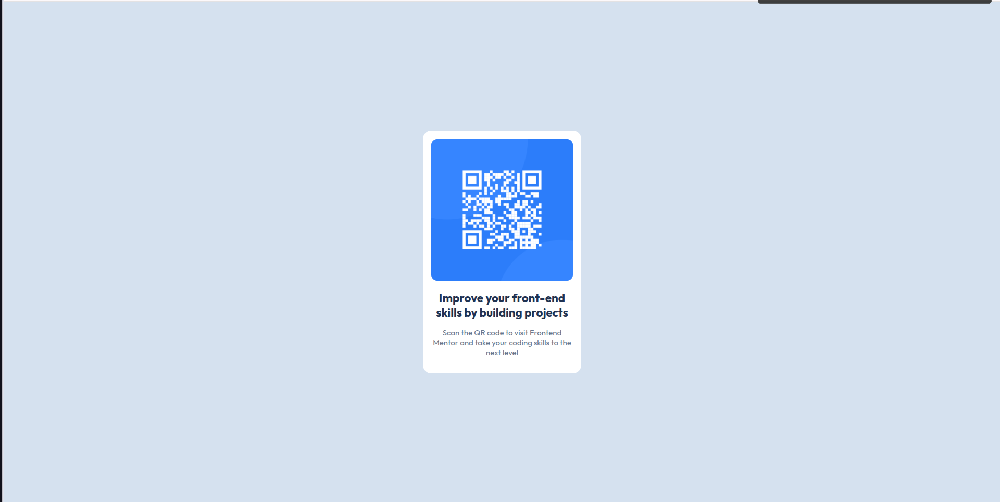

# Frontend Mentor - QR code component solution

This is a solution to the [QR code component challenge on Frontend Mentor](https://www.frontendmentor.io/challenges/qr-code-component-iux_sIO_H). Frontend Mentor challenges help you improve your coding skills by building realistic projects.

## Table of contents

- [Frontend Mentor - QR code component solution](#frontend-mentor---qr-code-component-solution)
  - [Table of contents](#table-of-contents)
  - [Overview](#overview)
    - [Screenshot](#screenshot)
    - [Links](#links)
  - [My process](#my-process)
    - [Built with](#built-with)
    - [What I learned](#what-i-learned)
    - [Continued development](#continued-development)
  - [Author](#author)
  - [Acknowledgments](#acknowledgments)

## Overview

### Screenshot

### Links

- Solution URL: [https://github.com/yashulilhare/fm-qr-code-component-main](https://github.com/yashulilhare/fm-qr-code-component-main)
- Live Site URL: [https://yashulilhare.github.io/fm-qr-code-component-main/](https://yashulilhare.github.io/fm-qr-code-component-main/)

## My process

### Built with

- Semantic HTML5 markup
- CSS custom properties
- Flexbox
- Mobile-first workflow

### What I learned

With this project I had some practice with HTML5, and CSS.

### Continued development

I used CSS as it was the project built with, I want to improve in create fluid, responsive webpages and components.

## Author

- Frontend Mentor - [@yashulilhare](https://www.frontendmentor.io/profile/yashulilhare)

## Acknowledgments

Thanks Frontend Mentor for providing us practice sets to improve our frontend skills.
